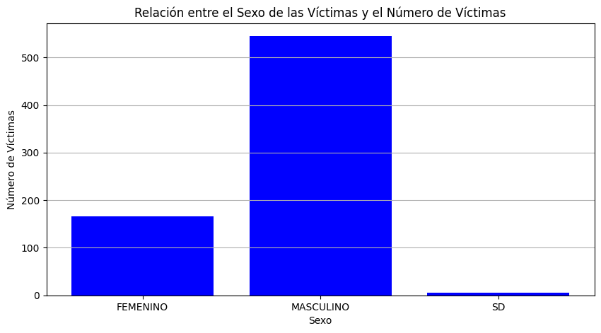
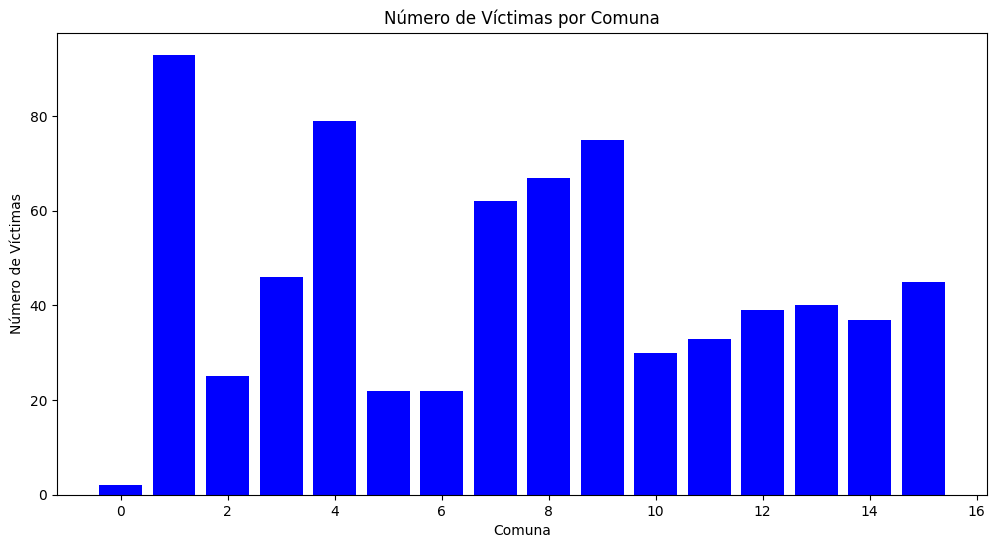
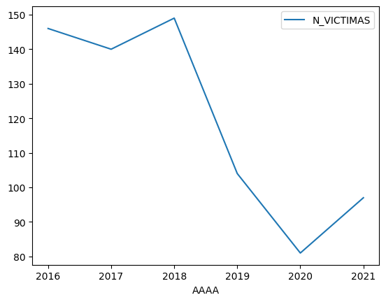
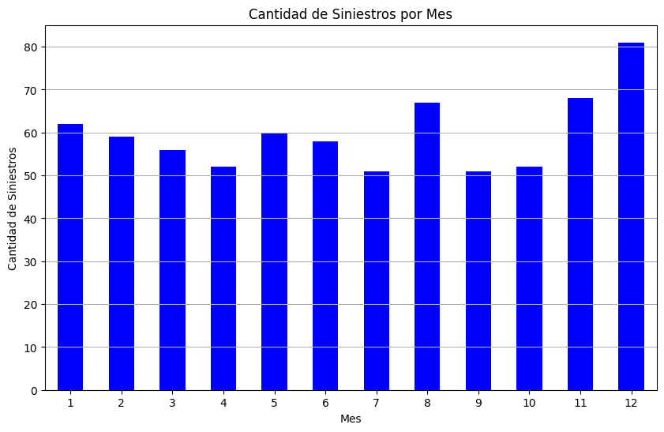
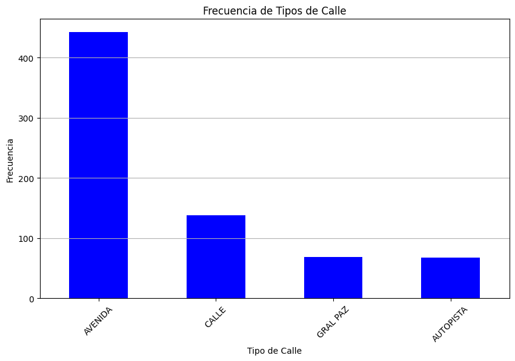

# Fenómenos viales

En Buenos Aires, los percances viales son una constante, manifestándose en diversas formas y afectando a peatones, ciclistas, automovilistas, motociclistas e incluso a los pasajeros del transporte público.

Los sucesos viales, también denominados incidentes de tráfico o de tránsito, son eventos que tienen lugar en las arterias públicas e incluyen desde choques vehiculares hasta atropellos, impactos contra objetos estáticos y vuelcos de vehículos. Estos sucesos pueden resultar en daños materiales, lesiones graves o, lamentablemente, en pérdidas de vidas humanas.

En una metrópolis como Buenos Aires, la preocupación por estos sucesos es significativa debido al denso tráfico y la alta densidad poblacional, lo que afecta la seguridad de residentes y visitantes, así como la infraestructura vial y los servicios de emergencia.

Las estadísticas de mortalidad relacionadas con estos sucesos son indicadores críticos de la seguridad vial, evaluándose en función del número de fallecimientos en relación con la población o el parque automotor. Reducir estas tasas es esencial para mejorar la seguridad y salvar vidas.

En Argentina, alrededor de 4,000 personas pierden la vida anualmente en estos sucesos, siendo la principal causa de muertes violentas. Entre 2018 y 2022, se registraron 19,630 fallecimientos según el Sistema Nacional de Información Criminal, equivalente a un promedio de 11 decesos diarios. En 2022, se contabilizaron 3,828 muertes.

# Descripción del proyecto:

El propósito primordial de este proyecto es efectuar un análisis de datos relacionados con homicidios en fenómenos viales ocurridos en la Ciudad de Buenos Aires entre los años 2016 y 2021. El objetivo es generar información relevante que pueda ser aprovechada por las autoridades locales para implementar medidas eficaces que disminuyan la cantidad de víctimas mortales en accidentes de tránsito.

# Metodología y herramientas:

Para llevar a cabo este proyecto, se siguieron los siguientes procesos:

Recopilación de Datos: Se accedió a un conjunto de datos suministrado por la Secretaría de Transporte del Gobierno de la Ciudad Autónoma de Buenos Aires, el cual proporcionaba información detallada sobre ho  micidios en accidentes de tránsito.

Preprocesamiento de Datos: Se procedió al preprocesamiento de los datos mediante el uso de la biblioteca Pandas para organizar y filtrar la información de manera adecuada.

Análisis Exploratorio de Datos (EDA): Se realizó un análisis exploratorio de datos en un entorno de cuaderno Jupyter con el objetivo de extraer información valiosa sobre los homicidios en fenómenos viales.

# Estructura de navegación de los archivos:

- Eda.ipynb: Este archivo, de tipo Jupyter Notebook, contiene el Análisis exploratorio de datos.
- KPI.ipynb: En este otro archivo de tipo Jupyter Notebook se abordan los KPI's expuestos en el dashboard.
- Datasets: Esta carpeta contiene los archivos "originales" que se utilizaron para el proyecto.
- img: Esta carpeta contiene las imagenes de los graficos obtenidos en el EDA
- Para_dashboard: Aquí se encuentran los datos procesados y preparados para su inclusión en el DashBoard.

# Análisis a profundidad de los datos

## Distribución por Género de las Víctimas

Al examinar los datos de homicidios en fenómenos viales, se observa que los hombres constituyen la mayoría de las víctimas anuales en accidentes de tráfico. Este hallazgo sugiere la necesidad de implementar medidas específicas de seguridad y concientización dirigidas a los conductores masculinos con el objetivo de reducir la tasa de accidentes mortales.

## Tipos de Vehículos Involucrados
Los datos también indican que las motocicletas son uno de los tipos de vehículos más frecuentemente implicados en accidentes mortales. Esto señala la importancia de centrar las políticas de seguridad vial en mejorar la seguridad de los motociclistas, como la promoción del uso obligatorio de cascos y la educación sobre la conducción segura de motocicletas.

## Comunas con Mayor Riesgo
Destaca la comuna 1 como la que presenta la mayor cantidad de accidentes mortales en la Ciudad de Buenos Aires. Este hallazgo sugiere la necesidad de intensificar las iniciativas de seguridad vial en esta área específica, como la implementación de zonas de velocidad controlada y campañas educativas dirigidas a los residentes de la comuna 1.

## Cambios en las Muertes Anuales
Es destacable la disminución en el número de muertes anuales en el año 2020. Este fenómeno podría estar vinculado a las restricciones de movilidad impuestas debido a la pandemia de COVID-19. Esto plantea la pregunta de si algunas de estas restricciones deberían mantenerse o modificarse para mantener una disminución en la tasa de accidentes mortales.

## Meses de Mayor Riesgo
Se evidencia que una considerable cantidad de incidentes en la vía pública mortales ocurren en el mes de diciembre, posiblemente relacionado con las festividades y el aumento de la movilidad durante las vacaciones. Esto subraya la importancia de reforzar la vigilancia y la concientización durante estos períodos festivos.

## Tipos de Vías

Al examinar los tipos de vías, se observa que las autopistas registran la menor cantidad de incidentes mortales. Esto podría ser atribuido a una mejor planificación de la seguridad vial en estas vías. Este hallazgo sugiere la necesidad de implementar estrategias similares en otras áreas con tasas de incidentes más elevadas.

## Cómo mejorar la situación:

Análisis Continuo: Se recomienda mantener un análisis continuo de los datos, actualizando regularmente la información sobre homicidios en incidentes en la vía pública en la Ciudad de Buenos Aires. Esto permitirá identificar tendencias a lo largo del tiempo y evaluar la efectividad de las medidas implementadas.

Mejorar la Educación Vial: Dado que los datos sugieren que los hombres constituyen la mayoría de las víctimas, propongo desarrollar iniciativas específicas de educación vial dirigidas a este grupo demográfico. Esto podría incluir campañas de concientización sobre prácticas de conducción seguras y el fomento del respeto a las normas de tráfico.

Respecto al tipo de vehiculo: Dado que las motocicletas son frecuentemente involucradas en incidentes mortales, se sugiere la implementación de medidas específicas para mejorar la seguridad de los motociclistas. Esto podría incluir programas de capacitación obligatorios, controles de seguridad más estrictos y campañas de concientización.

Enfoque en Comuna 1: Dada la alta incidencia de incidentes mortales en la Comuna 1, se propone intensificar las iniciativas de seguridad vial en esta área. Esto podría incluir la implementación de medidas de control de velocidad, mejoras en la señalización y programas educativos específicos para la comunidad local.

Evaluación de Restricciones COVID-19: Dado el descenso en el número de muertes anuales en 2020, relacionado con las restricciones de movilidad por la pandemia, sería beneficioso evaluar la posibilidad de mantener ciertas restricciones para reducir la tasa de incidentes mortales, ajustándolas según la situación actual.

Refuerzo en Meses de Mayor Riesgo: Dado que diciembre presenta una mayor cantidad de incidentes en la vía pública, se sugiere implementar medidas especiales de vigilancia y concientización durante este mes. Esto podría incluir campañas específicas y aumento de patrullajes.

Implementación de Estrategias en Otras Áreas: Considerando que las autopistas muestran la menor cantidad de incidentes mortales, se sugiere estudiar las estrategias de seguridad vial utilizadas en estas vías y evaluar su aplicación en otras áreas con tasas de incidentes más elevadas.
